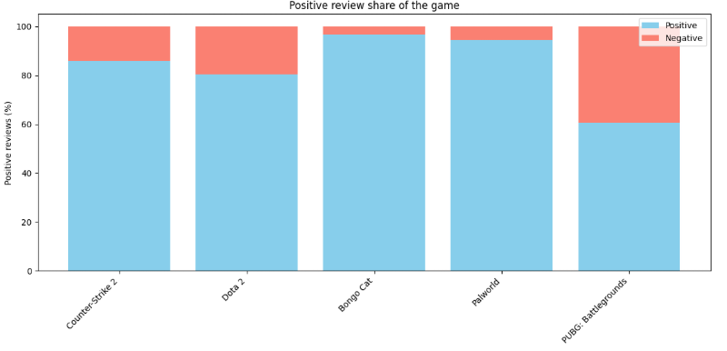
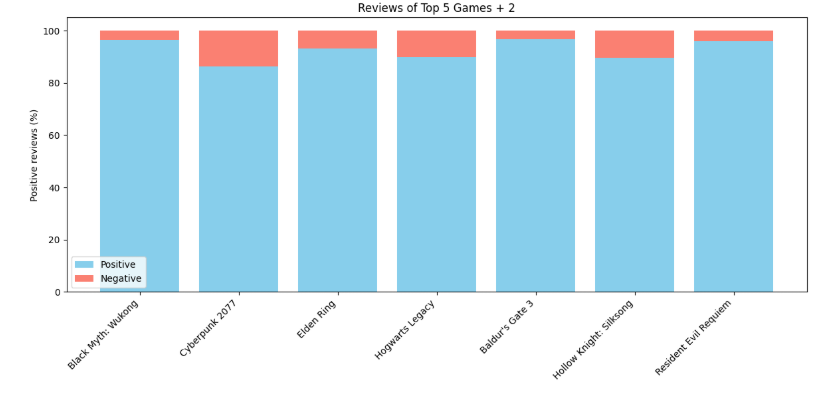
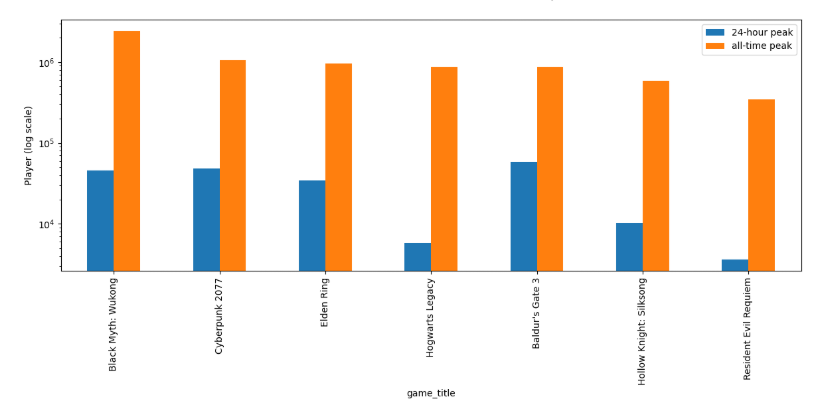

<h1 align = 'center'>Analyzing SteamDB Analysis</h1>


## What is SteamDB?

SteamDB is a open platform where users are allowed to review different types data, charts, sales, and track player activities as well.

In this project I decided that I reviewing a few metrics that I will be analyzing.

### First Metric

- Counter-Strike 2
- Dota 2
- Bongo Cat
- Palworld
- PUBG: Battlegrounds

<table>
  <tr>
    <td></td>
    <td></td>
    <td></td>
  </tr>
  <tr>
    <td></td>
    <td></td>
  </tr>
</table>


```python
Top_five_games_data = [
    [730, "Counter-Strike 2", "Valve", 2023, 85.9, 14.1, 1277861, 1862531, -80310, 80915, -138692, -157174, -5.1, 5.4, -8.8, -11.0],
    [570, "Dota 2", "Valve", 2013, 80.5, 19.5, 839635, 1295114, -30524, 201416, -6335, 142358, -4.4, 30.2, -0.7, 16.5],
    [3419430, "Bongo Cat", "Irox Games", 2025, 96.6, 3.4, 160125, 194508, 7920, -503, 6327, -6259, 4.5, -0.3, 3.5, -3.3],
    [1623730, "Palworld", "Pocketpair", 2026, 94.5, 5.5, 116515, 2101867, -18758, 20605, 910739, -359505, -38.1, 67.5, 1781.3, -37.4],
    [578080, "PUBG: Battlegrounds", "PUBG Corporation", 2017, 60.5, 39.5, 733906, 3257248, -159265, 5435, -22544, -17109, -16.2, 0.7, -2.7, -2.1]
]
```

Closely looking at the metrics that is being provided.

This chart will be displaying the:

- 24-Hour Peak
- All Time Peak
- Gain for May, June, July, and the last 30 days at the time I was working on this project

with a few percentages as well.

Look at games like Counter-Strike 2 the **24 Hour Peak** & **All Time Peak** It display a whole number between the <mark>1,277,861</mark> and <mark>1,862,531</mark> When carefully reviewing the metrics, **Counter-Strike 2** is one of the games that continues to have one of the highest peak along with games like **Dota 2** & **PUBG: Battlegrounds**.

However, there is a huge difference

```python
df["Peak %"] = (df["24-hour peak"] / df["all-time peak"] * 100).round(1)
```

By doing this calculation, this is going give the percent of 24-hour and all time peak.

Result:

0    68.6
1    64.8
2    82.3
3     5.5
4    22.5

Resuming back **Counter-Strike 2** we can see that the different between the **24 Hour Peak** & **All Time Peak** which is <mark>37.2</mark>

About a roughly **584,670**

Which is a huge amount. 


| Game | 24-Hour Peak | All-Time Peak | Difference | Peak % | Below Peak % |
|---|---:|---:|---:|---:|---:|
| Counter-Strike 2 | 1,277,861 | 1,862,531 | 584,670 | 68.6% | 31.4% |
| Dota 2 | 839,635 | 1,295,114 | 455,479 | 64.8% | 35.2% |
| Bongo Cat | 160,125 | 194,508 | 34,383 | 82.3% | 17.7% |
| Palworld | 116,515 | 2,101,867 | 1,985,352 | 5.5% | 94.5% |
| PUBG: Battlegrounds | 733,906 | 3,257,248 | 2,523,342 | 22.5% | 77.5% |

The question is why and how do these occur?

If we look at the rest of the table.

Video games that are online requires consistent updates to keep the player satisified.

All the games that is listed shows a difference. This could consist of day one launch where players are probably curious, new updates, and resuming from an old session, regardless. 

While games like

- Counter-Strike 2
- Dota 2
- PUBG: Battlegrounds

what is interesting is **Bongo Cat** & **Palworld**

While those two games have sure had their peaks. They are not a traditional live service game, where it's hyper competitive, one game is an idle clicker and the other is more of survival that can be played alone or with friends.

Let's look at the reviews.

```python
plt.bar(df["game_name"], df["Positive_reviews"], label = "Positive", color = "skyblue")
plt.bar(df["game_name"], df["Negative_reviews"], bottom=df["Positive_reviews"], label = "Negative", color = "salmon")

plt.ylabel("Positive reviews (%)")
plt.title("Positive review share of the game")
plt.xticks(rotation = 45, ha = "right")
plt.tight_layout()
plt.legend()
plt.show()
```



But looking at this graph carefully you can see that competitive/long service games tend to have a much larger impact. **PUBG: Battlegrounds** showing a huge metric of **negative reviews**. while games like **Palworld** & **Bongo Cat** are much lower negative reviews which means players are more content on playing games on their own pace.

Now let's review other metrics that is presened.

---

### Second Mertric

The second analysis we will be reviewing is more on <mark>Single Player Analysis</mark>

<table>
  <tr>
    <td></td>
    <td></td>
    <td></td>
  </tr>
  <tr>
    <td></td>
    <td></td>
    <td></td>
    <td></td>
  </tr>
</table>

```python
singlePlayer_analysis = [
    [2358720, "Black Myth: Wukong", "Game Science", 2024, 2415714, 45568, 96.5, 3.5],
    [1091500, "Cyberpunk 2077", "CD PROJEKT RED", 2020, 1054388, 47975, 86.4, 13.6],
    [1245620, "Elden Ring","FromSoftware, Inc." , 2022, 956426, 34201, 93.1, 6.9],
    [990080, "Hogwarts Legacy", "Avalanche Software", 2023, 879308, 5782, 89.8, 10.2],
    [1086940, "Baldur's Gate 3", "Larian Studios", 2023, 875343, 58487, 96.8, 3.2],

    [1030300,"Hollow Knight: Silksong", "Team Cherry", 2025, 587150, 10340, 89.5, 10.5],
    [3764200, "Resident Evil Requiem", "CAPCOM Co., Ltd.", 2026, 344214, 3630, 96.0, 4.0]
]
```

| Game | 24-Hour Peak | All-Time Peak | Difference | Peak % | Below Peak % | Positive Reviews |
|---|---:|---:|---:|---:|---:|---:|
| Black Myth: Wukong | 45,568 | 2,415,714 | 2,370,146 | 1.9% | 98.1% | 96.5% |
| Cyberpunk 2077 | 47,975 | 1,054,388 | 1,006,413 | 4.6% | 95.4% | 86.4% |
| Elden Ring | 34,201 | 956,426 | 922,225 | 3.6% | 96.4% | 93.1% |
| Hogwarts Legacy | 5,782 | 879,308 | 873,526 | 0.7% | 99.3% | 89.8% |
| Baldur's Gate 3 | 58,487 | 875,343 | 816,856 | 6.7% | 93.3% | 96.8% |
| Hollow Knight: Silksong | 10,340 | 587,150 | 576,810 | 1.8% | 98.2% | 89.5% |
| Resident Evil Requiem | 3,630 | 344,214 | 340,584 | 1.1% | 98.9% | 96.0% |

Review the data sets that is being presented in this work.

We can see that there is a huge difference when it comes down to the metric

**Multiplayer games** continue to have this ability to contain a large player base, yes even thoug the negative reviews are being presented, that doesn't change the fact that it will perform worse since the:

- Player base
- Community

Are the two factors that keep this high engagement that makes games thrive and succeed. 

**Single Player** will outperform multiplayer if they are well polished and actually has a good amount of content to play in,

but it varies.

By using the same calculation previously the game will have it's **all time peak** but <mark>WILL DROP SIGNIFICANTLY</mark> once the days goes on.

If we compare the single player game metrics to live service/online competitive games when it comes to reviews it really shows a huge difference.

The negative reivews comes from different metrics like

- Difficulty of the game
- Bugs on release
- Not fun to play or other unknown reasons





